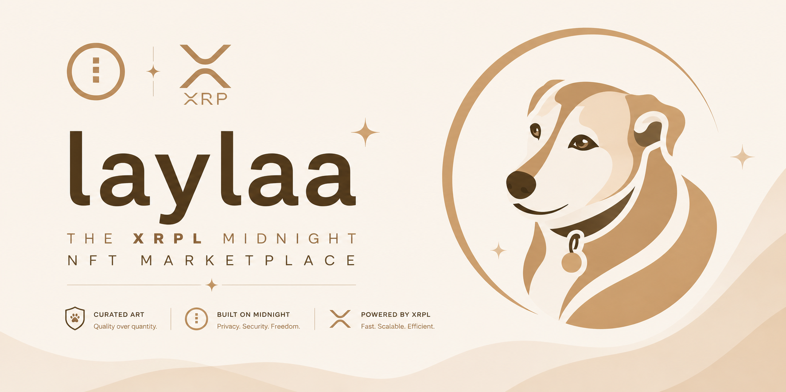
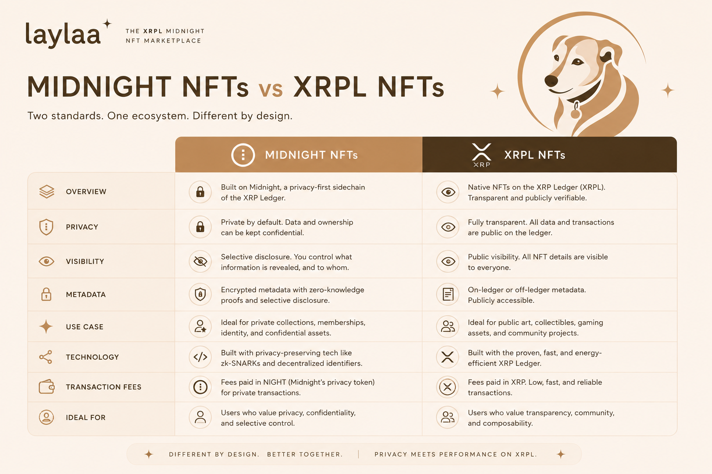

<p align="center">
  
</p>

# Layla

A cross-chain NFT marketplace bridging **XRPL** and **Midnight**. Built on the [Midnight Network](https://midnight.network/) with XRPL mainnet/testnet integration.

[](https://shields.io/) [](https://shields.io/)

Layla unifies XRPL and Midnight NFTs in one app: browse and trade XRPL mainnet collections, mint on XRPL Testnet or Midnight Preview, and move assets across chains with a burn-to-mint bridge.

## Features

The dApp is organized into five tabs:

### Market
- **Live Auctions** — time-limited XRPL NFT auctions with public or private bids.
- **Newly Listed on Layla** — XRPL NFTs freshly listed on the platform (auto-refreshes every 30s).
- **Curated List** — hand-picked featured collections, pulled live from XRPL mainnet by issuer.
- **XRPL Collections** — live mainnet collections grouped by issuer.
- **Your Listed NFTs** — your connected wallet's actively-listed NFTs.
- **Trending** — trending XRPL mainnet NFTs via Bithomp (with a sample fallback).
- **Midnight Preview Listings** — active listings from the Midnight marketplace contract.

### Create
- **Mint** — drop an image, set metadata, and mint on **XRPL Testnet** or **Midnight Preview**.
- **Batch mint** and **platform collections** for issuing multiple NFTs / a collection at once.
- **Token-to-NFT** minting in three modes: **hold-gated** (own a token), **pay-to-treasury**, and **burn**.

### My NFTs
- **My Midnight NFTs** — NFTs you own on Midnight Preview; list them on the marketplace.
- **My XRPL NFTs** — NFTs in your XRPL wallet; list for sale in XRP or place a private bid.
- **Incoming NFTs** — pending transfers to your wallet, accepted via Xaman.

### Burn (Bridge)
- **Burn-to-mint bridge** — burn an XRPL NFT or fungible token to mint its Midnight counterpart.

### Wallets
- Connect **Lace (Midnight)** and **Xaman (XRPL)**; deploy/join the Midnight NFT, Bridge, Marketplace, and Collection contracts.

## XRPL vs Midnight NFTs

Layla works across two very different NFT models — XRPL's native, public NFTokens and Midnight's privacy-preserving, zero-knowledge contracts.

<p align="center">
  
</p>

## Project Structure

```
example-counter/
├── contracts/midnight/                # Compact smart contracts
│   ├── nft/                           # NFT contract (mint/transfer/burn)
│   ├── bridge/                        # Bridge contract (burn redemption)
│   ├── marketplace/                   # Marketplace contract (list/buy)
│   └── collection/                    # Collection contract
├── packages/
│   ├── web/                           # Vite + React + Tailwind dApp
│   │   ├── src/components/pages/      # Market, Create, My NFTs, Burn, Wallets
│   │   ├── src/lib/midnight.ts        # Lace + contract ops
│   │   ├── src/lib/xrpl.ts            # Network-aware XRPL client
│   │   ├── src/lib/xaman.ts           # Xaman frontend client
│   │   ├── src/lib/tokens.ts          # Token registry
│   │   └── src/lib/aggregator.ts      # Trending NFT aggregator
│   ├── xaman-backend/                 # Express + xumm-sdk backend
│   │   └── src/index.ts               # Sign payloads + verification
│   └── nftmarket-cli/                 # CLI — deploy contracts + test flows
│       └── proof-server.yml           # Local proof server (Docker)
└── docs/
    ├── PLAN.md                        # Living implementation plan
    └── HANDOVER.md                    # Cold-start run instructions
```

## Prerequisites

- [Node.js v22.15+](https://nodejs.org/) — `node --version` to check
- [Docker](https://docs.docker.com/get-docker/) with `docker compose` — used for the local proof server

### Compact Developer Tools (devtools)

The Compact devtools manage and invoke the Compact toolchain (compiler, formatter, fixup tool, etc.).

Install the devtools and toolchain:

```bash
# Install the Compact devtools
curl --proto '=https' --tlsv1.2 -LsSf https://github.com/midnightntwrk/compact/releases/latest/download/compact-installer.sh | sh

# Add to PATH
source $HOME/.local/bin/env

# Install the toolchain version used by this project
compact update 0.30.0

# Verify
compact compile --version
```

> If you already have the devtools installed, run `compact self update` to get the latest version. If you encounter issues, `compact clean` will reset your `.compact` directory.

## Setup

### 1. Install dependencies

```bash
npm install
```

### 2. Build the contract packages

Compile and build all four Compact contracts:

```bash
npm run compact -w @nftmarket/nft-contract && npm run build -w @nftmarket/nft-contract
npm run compact -w @nftmarket/bridge-contract && npm run build -w @nftmarket/bridge-contract
npm run compact -w @nftmarket/marketplace-contract && npm run build -w @nftmarket/marketplace-contract
npm run compact -w @nftmarket/collection-contract && npm run build -w @nftmarket/collection-contract
```

> The first compile may download zero-knowledge parameters (~500MB). This is a one-time download.

### 3. Configure environment

```bash
# Backend
cp packages/xaman-backend/.env.example packages/xaman-backend/.env
# Edit .env: XUMM_API_KEY, XUMM_API_SECRET, TESTNET_MINT_SEED, TREASURY_ADDRESS, PINATA_JWT

# Web
cp packages/web/.env.example packages/web/.env
# Edit .env: VITE_BITHOMP_API_KEY, VITE_TREASURY_ADDRESS, and the VITE_*_ADDRESS contract overrides
```

## Deploy the Midnight contracts (CLI)

The dApp joins pre-deployed Midnight Preview contracts on connect. **If you change a contract's source, you must redeploy it and update its address** — otherwise the dApp fails to join with a *verifier-key mismatch*.

### 1. Start the proof server

```bash
docker compose -f packages/nftmarket-cli/proof-server.yml up
```

Wait for: `... listening on: 0.0.0.0:6300`.

### 2. Run the CLI and deploy

```bash
npm run dev -w @nftmarket/cli        # defaults to Midnight Preview
# or explicitly: npm run preview -w @nftmarket/cli
```

In the interactive menu:

1. **Midnight Wallet** → create or restore a wallet, fund it from the [Preview faucet](https://faucet.preview.midnight.network), and wait for DUST to generate.
2. **Deploy contracts** → **Deploy ALL contracts** (NFT + Bridge + Marketplace + Collection).
3. **Deploy contracts** → **Show deployed contract addresses**, then copy them.

### 3. Wire the addresses into the dApp

Add the deployed addresses to `packages/web/.env` (these override the defaults baked into `packages/web/src/lib/midnight.ts`):

```bash
VITE_NFT_ADDRESS=<nft address>
VITE_BRIDGE_ADDRESS=<bridge address>
VITE_MARKETPLACE_ADDRESS=<marketplace address>
VITE_COLLECTION_ADDRESS=<collection address>
```

## Run the dApp

Keep the proof server running, then start the backend and web app in separate terminals:

```bash
# Terminal 1 — backend
npm run dev -w @nftmarket/xaman-backend

# Terminal 2 — web
npm run dev -w @nftmarket/web
```

Open http://localhost:5173. Connect **Lace (Midnight)** and **Xaman (XRPL)** wallets. The dApp auto-joins the configured contracts on connect.

## Troubleshooting

| Issue | Solution |
|-------|----------|
| `compact: command not found` | Run `source $HOME/.local/bin/env` to add it to your PATH. |
| `connect ECONNREFUSED 127.0.0.1:6300` | Start the proof server: `docker compose -f packages/nftmarket-cli/proof-server.yml up` |
| `... are undefined or have mismatched verifier keys for contract state` | The deployed contract no longer matches your local build. Redeploy it via the CLI and update the `VITE_*_ADDRESS` in `packages/web/.env`. |
| Proof server hangs on Mac ARM (Apple Silicon) | In Docker Desktop: Settings → General → "Virtual Machine Options" → select **Docker VMM**. Restart Docker after changing. |
| `Failed to clone intent` during deploy | Wallet SDK signing bug — already worked around in this codebase. Ensure you're running the latest code. |
| DUST balance drops to 0 after failed deploy | Known wallet SDK issue. Restart and wait for DUST to regenerate to release locked coins. |
| Wallet shows 0 balance after faucet | Wait for sync to complete. If still 0, check that you sent to the correct unshielded address. |
| Could not find a working container runtime strategy | Docker isn't running. Start Docker and try again. |
| Contract build fails with "Cannot find module" | Build the contract packages first (see **Setup → Build the contract packages**). |
| Node.js warnings about experimental features | Normal — these don't affect functionality. |

## Documentation

- [docs/PLAN.md](docs/PLAN.md) — Living implementation plan and decisions
- [docs/HANDOVER.md](docs/HANDOVER.md) — Cold-start run instructions and current state
- [docs/LAUNCH_PLAN.md](docs/LAUNCH_PLAN.md) — Mainnet launch plan, fix list, and Railway deployment
- [MARKETPLACE.md](MARKETPLACE.md) — Marketplace architecture overview

> Older counter-template, GxgNight, and migration docs have been archived to the git-ignored `unused/` folder.

## Useful Links

- [Preview Faucet](https://faucet.preview.midnight.network) — Get Preview tNight tokens
- [Midnight Documentation](https://docs.midnight.network/) — Developer guide
- [Compact Language Guide](https://docs.midnight.network/compact) — Smart contract language reference
- [XRPL Documentation](https://xrpl.org/docs.html) — XRPL ledger reference
